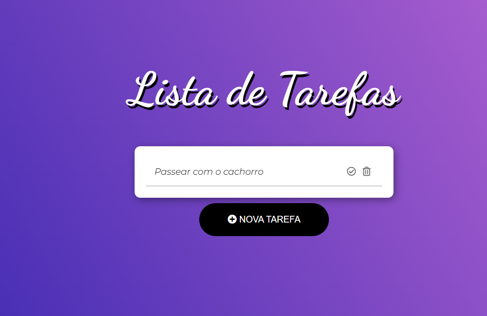

# Todo List

This project is a to-do list application developed with [Angular CLI](https://github.com/angular/angular-cli) version 19.0.2. It allows you to manage tasks in a simple and efficient way, with functionalities for creating, editing and deleting tasks.

---

## Project Images

**Image of the project in operation:**

<p align="center">

</p>

**Technologies Used:**

<p align="center">

</p>

---

## How to Start the Project

### Development Server

To start a local development server, run the following command:

```bash
ng serve
```

After starting the server, open your browser and access `http://localhost:4200/`. The application will be reloaded automatically whenever you modify any source file.

---

## Code Structuring

The Angular CLI includes powerful tools for structuring code. To generate a new component, use:

```bash
ng generate component component-name
```

To view all available schemas (such as `components`, `directives`.), run:

```bash
ng generate --help
```

---

## How to Build the Project

To compile the project, run:

```bash
ng serve
```

The build artifacts will be stored in the `dist/` directory. The production build is optimized for performance and speed.

---

## Tests

### Unit Tests

To run unit tests using [Karma](https://karma-runner.github.io), use:

```bash
ng test
```

### End-to-End (e2e) Tests

To run end-to-end tests:

```bash
ng e2e
```

The Angular CLI does not have an end-to-end testing framework by default. You can choose the one that best suits your needs.

---

## Additional Resources

- [Angular CLI Overview](https://angular.dev/tools/cli)
- [Official Angular Documentation](https://angular.io/docs)

---

## Contact

If you have any questions or suggestions, please contact us:

- **LinkedIn:** [Sansão Dembué Vieira](https://www.linkedin.com/in/sansaovieira/)
- **GitHub:** [github.com/sansaovieira](https://github.com/sansaovieira)
- **Email:** vieirasansao42@gmail.com

---
